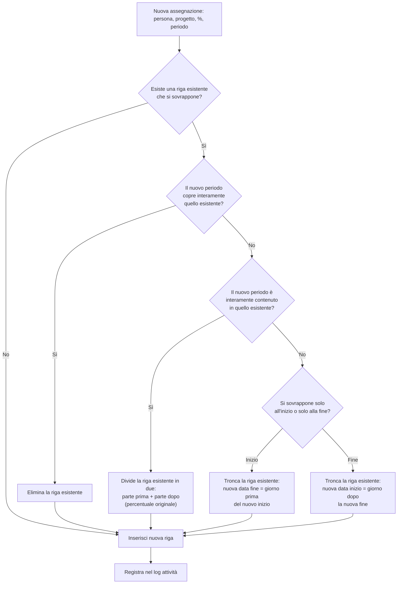
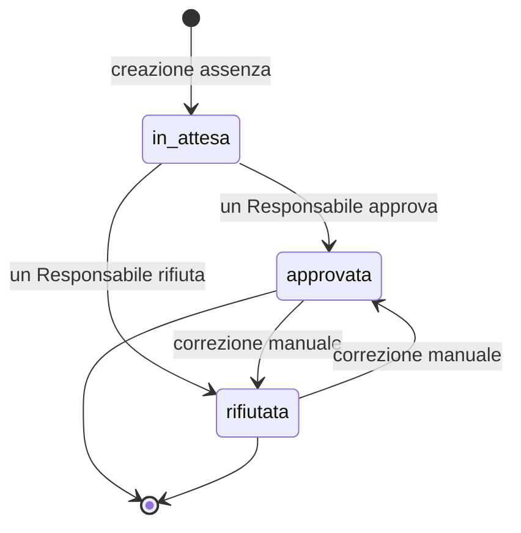
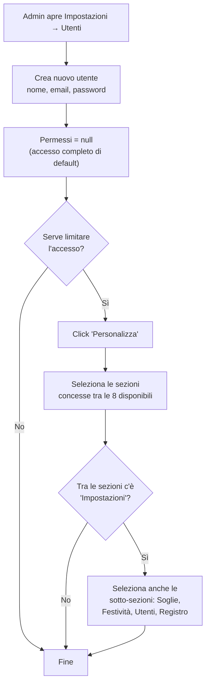

# Documentazione funzionale

## 1. Scopo del sistema

WorkForce Manager è un'applicazione web per la pianificazione e il controllo
della capacità di un team di consulenza/delivery: chi lavora su quali
progetti, con quale percentuale di impegno, chi è sotto o sovra-allocato, chi
è assente e quando, e chi possiede (come Project Manager) quali commesse.

Sostituisce fogli Excel condivisi con una fonte dati unica, con storicità
(registro attività), workflow di approvazione e viste aggregate per persona,
per progetto e per PM.

## 2. Due concetti di "persona" da non confondere

Il sistema distingue due entità che nel linguaggio comune si chiamano
entrambe "persona", ma hanno scopi diversi:

| | **Utente (`users`)** | **Persona (`people`)** |
|---|---|---|
| A cosa serve | Accedere all'applicazione (login) | Essere una risorsa pianificabile (staffing, ferie, capacità) |
| Dove si gestisce | Impostazioni → Utenti | Persone |
| Ha una password? | Sì | No — non fa login |
| Ha i permessi sulle sezioni? | Sì | No |
| Esempio | `mario.rossi@azienda.com`, admin che entra nel gestionale | "Mario Rossi", developer allocato al 60% su un progetto |

Le due tabelle **non sono collegate** da una chiave esterna: un utente che
amministra il sistema non deve necessariamente esistere anche come persona
staffabile, e viceversa una persona pianificata non ha necessariamente un
proprio accesso all'applicazione (nella pratica attuale, ad oggi il
personale non si autentica: solo chi amministra/pianifica accede al
gestionale). Questo è un limite noto, discusso in
[04-sicurezza.md](04-sicurezza.md#6-rischi-noti-e-possibili-evoluzioni).

## 3. Moduli funzionali

La navigazione principale (sidebar) espone otto sezioni; quali di queste un
utente vede dipende dai suoi permessi (vedi
[04-sicurezza.md](04-sicurezza.md)).

### 3.1 Dashboard (`/`)
Vista di sintesi con indicatori aggregati raggruppati in tre cluster ("Team",
"Progetti", "Ferie"): numero di persone, persone fuori soglia di
allocazione, allocazione media del team, capacità libera in ore/FTE,
progetti attivi/in scadenza/in partenza/senza risorse, giorni di assenza nel
periodo, richieste in attesa di approvazione. La sezione "Allocazione per
persona" usa una visualizzazione executive-board: ogni risorsa è mostrata
come riga sintetica con barra colorata, percentuale e conteggio di persone in
sotto-/OK-/sovra-allocazione. Il dettaglio per persona si apre in drilldown,
così la dashboard resta compatta e adatta a una lettura manageriale rapida
dove l'obiettivo è identificare subito i casi critici.

### 3.2 Persone (`/people`, `/people/:id`)
Anagrafica delle risorse pianificabili: nome, ruolo, email, **tipo risorsa**
(`consulente`/`stage`/`dipendente`), colore identificativo, capacità
settimanale base (ore), responsabile gerarchico (`managerId`,
auto-riferimento sulla stessa tabella), flag "Responsabile" (`isApprover`,
abilita ad approvare le assenze altrui). CRUD completo, import/export CSV.
Il dettaglio persona mostra lo storico assegnazioni, le assenze e i periodi
di capacità variabile (override temporanei della capacità base, es.
part-time a termine).

### 3.3 Progetti (`/projects`, `/projects/:id`)
Anagrafica commesse: nome, cliente, stato (`planned`/`active`/`on_hold`/
`completed`), tipo di delivery (`TK`/`T&M`/`TaaS`/`AMS`), PM responsabile,
periodo (data inizio/fine), colore. Un identificativo di commessa
(`commessaId`) viene generato automaticamente dal nome e dalla data di
creazione (slug + data). CRUD completo, import/export CSV.

### 3.4 Per PM (`/per-pm`)
Portfolio dei progetti raggruppato per Project Manager responsabile (incluso
un gruppo "Nessun PM assegnato"): per ciascun PM mostra numero di progetti
attivi, in scadenza, senza risorse nel periodo, persone coinvolte e
allocazione media — la stessa metrica della Dashboard ma vista dal punto di
vista del portfolio di un singolo PM, con filtro temporale (settimana/mese/anno).

### 3.5 Staffing (`/staffing`)
Elenco/gestione delle assegnazioni persona↔progetto↔percentuale↔periodo.
Da qui si creano nuove assegnazioni, anche con opzione "sovrascrivi" che
gestisce automaticamente la sovrapposizione con assegnazioni esistenti sullo
stesso progetto (vedi [§4.1](#41-allocazione-e-staffing)). In creazione,
la UI mostra conferme esplicite in due casi: nuova allocazione che porta la
persona oltre il 100% nel periodo selezionato, oppure progetto selezionato
con stato diverso da `active`. Import/export CSV.

### 3.6 Calendario (`/calendar`)
Vista a griglia persona × periodo (settimana/mese/anno), con due modalità:
- **Staffing**: percentuale di allocazione per giorno/periodo, colorata in
  base alle soglie (sotto-allocato / 70–100% / sovra-allocato), con editing
  inline (click su una cella per modificare la percentuale di
  un'unità — giorno/settimana/mese/anno — che **divide automaticamente**
  l'assegnazione originale in più righe, vedi [§4.1](#41-allocazione-e-staffing)).
- **Ferie/Assenze**: stessa griglia ma con i tipi di assenza (ferie,
  malattia, permesso, formazione, altro) e le festività aziendali, distinte
  dalle assenze personali.

### 3.7 Ferie/Assenze (`/absences`)
Elenco assenze con filtri (persona, tipo, stato, anno), riepilogo giorni per
persona nell'anno selezionato (esclude le assenze rifiutate), workflow di
approvazione (approva/rifiuta, anche in blocco su selezione multipla),
import/export CSV.

### 3.8 Impostazioni (`/settings`)
Quattro sotto-sezioni, ciascuna con un proprio permesso indipendente (vedi
[04-sicurezza.md](04-sicurezza.md#2-autorizzazione-modello-a-permessi)):

- **Soglie**: percentuali di sotto/sovra-allocazione usate per colorare
  Dashboard, Persone e Calendario.
- **Festività**: festività aziendali/nazionali condivise, visibili nel
  Calendario ma distinte dalle assenze personali.
- **Utenti**: chi può accedere al gestionale, con quali permessi per
  sezione; creazione, modifica, disattivazione ed **eliminazione** account.
- **Registro attività**: log di audit (chi ha creato/modificato/eliminato
  cosa e quando), filtrabile per utente, tipo di entità e intervallo di date.

## 4. Processi di business

### 4.1 Allocazione e staffing

Un'assegnazione (`assignments`) collega una persona a un progetto per un
periodo con una percentuale di impegno. Più assegnazioni sullo stesso giorno
si **sommano** (una persona può essere staffata al 60% su un progetto e al
40% su un altro nella stessa settimana → 100% totale).

In fase di inserimento da UI, prima del salvataggio il sistema chiede
conferma all'utente se la nuova riga comporta **sovra-allocazione >100%**
nel periodo o se il progetto è in stato diverso da `active`.

Due operazioni meritano attenzione perché contengono la logica di dominio
più delicata del sistema:

**Sovrascrittura (`POST /assignments/overwrite`)** — usata quando si crea
una nuova assegnazione che si sovrappone a una esistente sullo stesso
progetto/persona. Il sistema calcola l'intersezione e decide automaticamente
come trattare la riga esistente:

**Modifica puntuale da Calendario (`POST /assignments/:id/split`)** — quando
si clicca una cella del Calendario per cambiare la percentuale di una sola
unità (giorno/settimana/mese/anno) all'interno di un'assegnazione più ampia,
l'assegnazione originale viene divisa in un massimo di tre parti: la parte
prima dell'unità modificata (percentuale invariata), l'unità stessa (nuova
percentuale) e la parte dopo (percentuale invariata) — le parti che
cadrebbero fuori dai confini originali vengono omesse.

La **capacità** di una persona (ore/settimana usate per calcolare se è
sotto/sovra-allocata) è normalmente il valore base (`capacityHoursPerWeek`)
ma può essere sovrascritta per un intervallo di date tramite
`person_capacity_periods` (es. un part-time temporaneo) — la risoluzione
sceglie il primo periodo che copre il giorno richiesto, altrimenti usa il
valore base.

### 4.2 Richiesta e approvazione assenze

Chi può approvare/rifiutare non è vincolato via codice a una gerarchia
specifica (qualunque utente con accesso alla sezione Ferie/Assenze può
farlo) — il flag `isApprover` su una persona è **informativo/di ruolo**
(mostrato come badge "Responsabile" in Persone) più che un vincolo
tecnico enforced dal server. Le assenze **rifiutate** non contano nel
riepilogo giorni per persona né, quando la richiesta è ancora `in_attesa`,
nel conteggio "richieste in attesa" della Dashboard una volta decise.

> **Nota**: il sistema non invia notifiche automatiche (email o altro) al
> richiedente o all'approvatore — l'approvazione è visibile solo accedendo
> alla sezione Ferie/Assenze. Vedi le note di miglioramento in
> [04-sicurezza.md](04-sicurezza.md#6-rischi-noti-e-possibili-evoluzioni).

### 4.3 Gestione utenti e permessi

Il dettaglio del modello a permessi, incluse le regole di auto-protezione
(un utente non può togliersi da solo l'accesso a Impostazioni → Utenti), è
in [04-sicurezza.md](04-sicurezza.md#2-autorizzazione-modello-a-permessi).

### 4.4 Import/export CSV

Persone, Progetti, Assegnazioni e Assenze supportano import ed export CSV
(oltre a un template scaricabile). L'import è **tollerante**: righe non
valide (dati mancanti, persona/progetto non trovati per nome, date non
riconosciute) vengono **saltate** singolarmente — l'importazione non fallisce
nel suo complesso — e la risposta riporta quante righe sono state importate e
quante saltate, così l'utente può correggere e ripetere solo quelle
mancanti. Per le Persone, la risposta include anche il **motivo puntuale per
riga** (es. nome mancante, tipo non valido, capacità non valida) mostrato
nel popup lato UI.

## 5. Casi d'uso principali

| Attore | Caso d'uso | Dove |
|---|---|---|
| Resource/People manager | Verificare chi è sotto o sovra-allocato questa settimana | Dashboard, Calendario |
| Resource/People manager | Assegnare una persona a un nuovo progetto | Staffing, Progetti → dettaglio |
| Project Manager | Vedere lo stato del proprio portfolio commesse | Per PM |
| Chiunque pianifichi | Modificare l'allocazione di una singola settimana senza toccare il resto del periodo | Calendario (editing inline) |
| Dipendente/Risorsa (tramite chi la rappresenta nel sistema) | Registrare una richiesta di ferie/malattia | Ferie/Assenze |
| Responsabile | Approvare o rifiutare richieste di assenza, anche in blocco | Ferie/Assenze |
| Amministratore | Creare/disattivare/eliminare utenti e limitarne l'accesso per sezione | Impostazioni → Utenti |
| Amministratore | Configurare le soglie di allocazione e le festività aziendali | Impostazioni → Soglie / Festività |
| Amministratore/Auditor | Verificare chi ha creato/modificato/eliminato cosa | Impostazioni → Registro attività |

## 6. Glossario

| Termine | Significato |
|---|---|
| **Commessa** | Progetto/contratto cliente; identificato da `commessaId` (slug nome + data creazione) |
| **Delivery type** | Modalità contrattuale della commessa: `TK` (time&material a corpo/Time&Konsulting), `T&M` (Time & Material), `TaaS` (Team as a Service), `AMS` (Application Management Services) |
| **Allocazione** | Percentuale di tempo di una persona impegnata su un progetto in un dato periodo |
| **Sotto/sovra-allocazione** | Allocazione totale di una persona sotto la soglia minima o sopra la soglia massima configurata (default 70% / 100%) |
| **FTE** | Full-Time Equivalent, unità di misura della capacità espressa in "persone a tempo pieno equivalenti" |
| **Responsabile (isApprover)** | Persona abilitata, per convenzione, ad approvare le assenze altrui |
| **PM** | Project Manager responsabile di una o più commesse (`pmId` su `projects`) |
