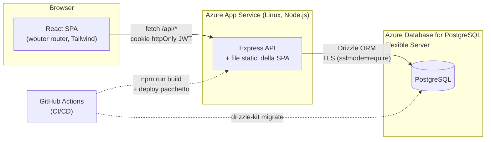
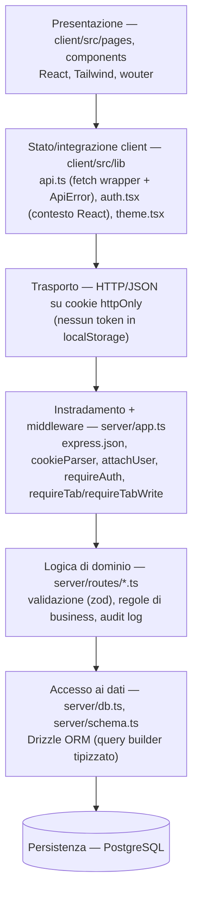
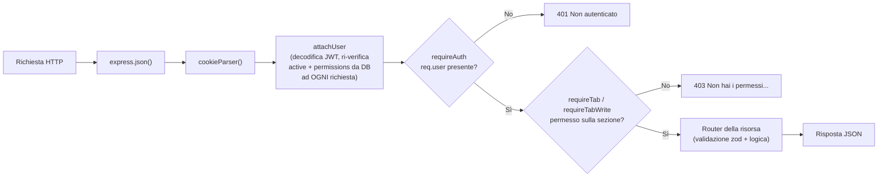
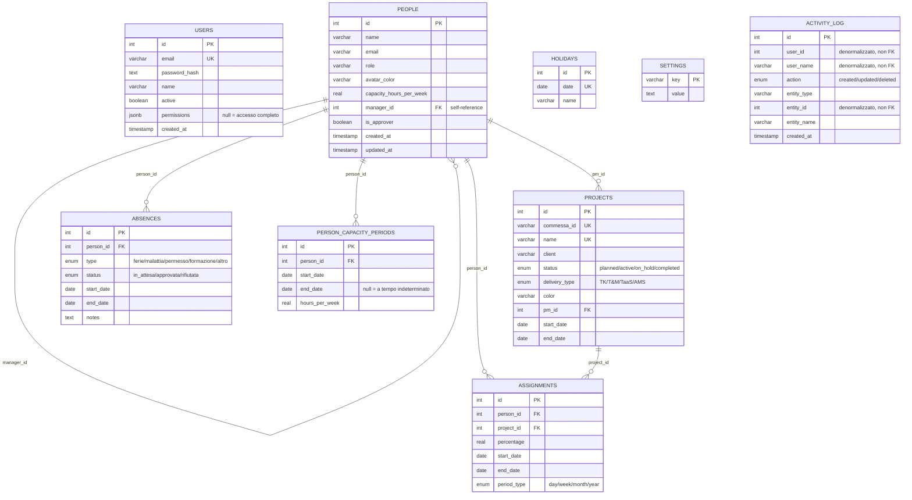
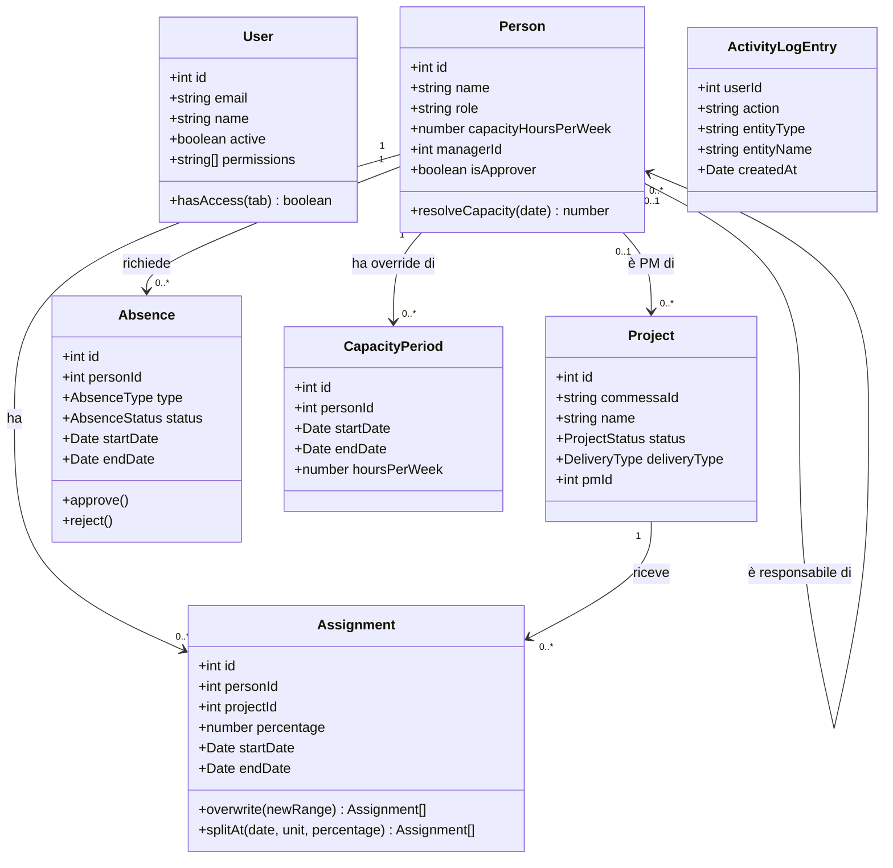
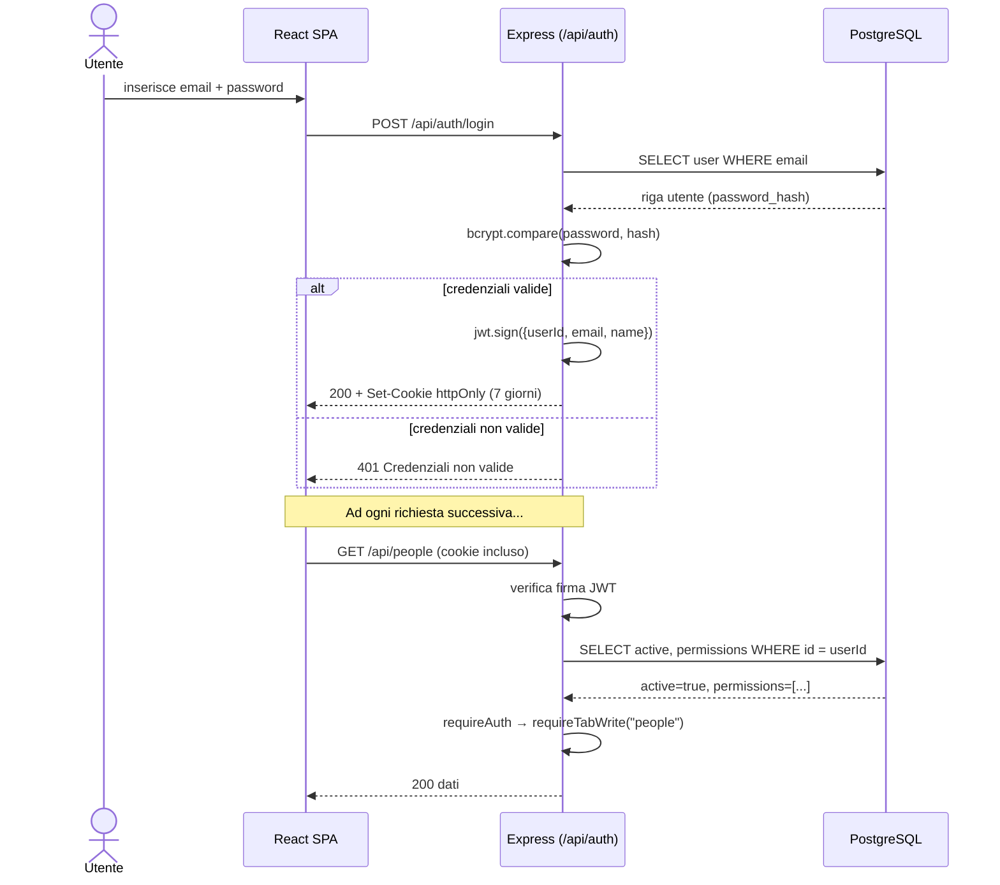
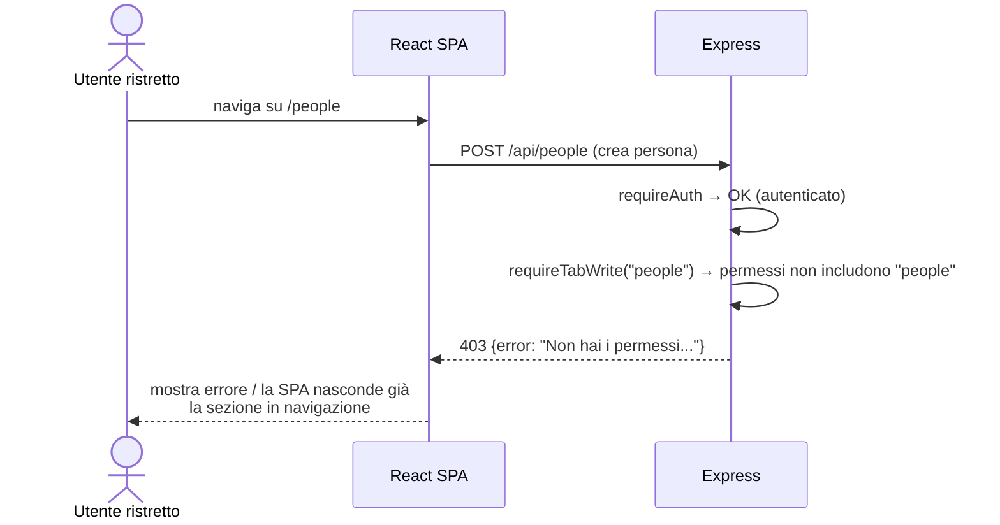
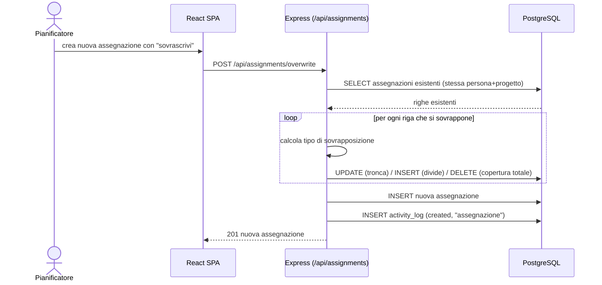
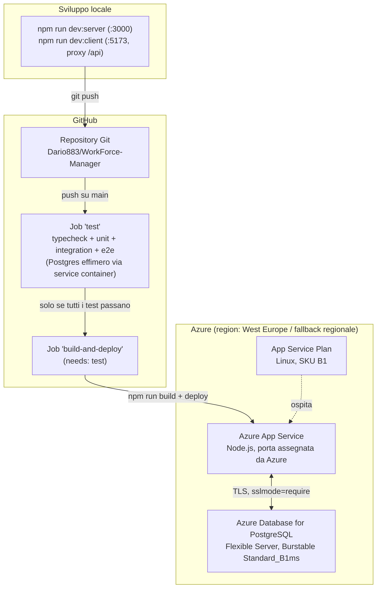

# Documentazione architetturale

## 1. Vista d'insieme

Applicazione web classica a tre livelli: SPA React servita al browser,
API REST stateless su Express, database relazionale PostgreSQL. Nessun
servizio esterno di terze parti (nessun SaaS di autenticazione, nessuna coda
di messaggi, nessuna cache distribuita): la superficie da mantenere è
volutamente minima.

In produzione, `npm run build` compila la SPA (Vite) in file statici e
impacchetta il server (esbuild) in un unico bundle Node; **lo stesso
processo Express** serve sia le API (`/api/*`) sia i file statici della SPA
(fallback su `index.html` per il routing lato client) — un solo servizio da
distribuire, nessun reverse proxy dedicato al frontend.

## 2. Layer applicativi

Ogni layer ha una responsabilità unica e non salta livelli: i componenti
React non parlano mai direttamente al database, i router Express non
generano mai HTML, l'accesso ai dati passa sempre da Drizzle (mai SQL grezzo
sparso nei router, salvo il singolo `TRUNCATE` usato solo nell'harness dei
test — vedi [03-tecnica.md](03-tecnica.md#5-testing)).

## 3. Catena middleware (Express)

Ogni richiesta verso `/api/*` (eccetto `/api/auth/*`, pubblico) attraversa
questa catena, definita in `server/app.ts`:

Il dettaglio di quali sezioni sono richieste per ciascuna risorsa è in
[04-sicurezza.md](04-sicurezza.md#matrice-endpoint--permesso-richiesto).

## 4. Modello dati (diagramma entità-relazione)

Note di progettazione del modello dati:

- **`USERS` non ha alcuna relazione con `PEOPLE`** (vedi
  [01-funzionale.md §2](01-funzionale.md#2-due-concetti-di-persona-da-non-confondere)):
  sono due domini distinti (accesso vs. risorsa pianificabile).
- **`ACTIVITY_LOG` è volutamente denormalizzato**: `user_id`, `user_name`,
  `entity_id` sono colonne semplici, non chiavi esterne, così il log resta
  leggibile e integro anche se l'utente che ha compiuto l'azione o l'entità
  modificata vengono in seguito eliminati.
- **`PERMISSIONS` è un array JSON nullable** (non una tabella di join
  utente↔permesso): `null` significa "accesso completo" (comportamento di
  default per compatibilità con gli utenti esistenti prima dell'introduzione
  del modello a permessi); un array esplicito elenca le sezioni concesse.
  Questa scelta evita una tabella aggiuntiva per un caso d'uso semplice
  (poche decine di chiavi possibili, note staticamente in `shared/types.ts`).
- **Eliminazioni a cascata**: eliminare una persona elimina a cascata le sue
  assegnazioni, assenze e periodi di capacità (`onDelete: "cascade"`);
  eliminare il responsabile di un'altra persona o il PM di un progetto
  imposta invece `manager_id`/`pm_id` a `null` (`onDelete: "set null"`) —
  non si perdono righe collegate solo perché un riferimento gerarchico
  viene rimosso.

## 5. Modello di dominio (diagramma delle classi)

Vista orientata agli oggetti delle stesse entità, con i metodi/le regole di
dominio più rilevanti (non necessariamente implementati come metodi di
classe nel codice — qui la logica è funzionale, dentro ai router — ma
concettualmente di competenza di ciascuna entità):

> `permissions`, `managerId`, `pmId` ed `endDate` (in `CapacityPeriod`) sono
> nullable — omesso dal diagramma per leggibilità, dettagliato nell'[ER
> diagram](#4-modello-dati-diagramma-entità-relazione) sopra.

## 6. Diagrammi di sequenza

### 6.1 Login e verifica continua della sessione

La ri-verifica di `active`/`permissions` **ad ogni richiesta** (non solo al
login) è la scelta architetturale chiave dell'autenticazione: disattivare un
utente o restringergli i permessi ha effetto immediato, senza dover
invalidare o attendere la scadenza del token.

### 6.2 Richiesta bloccata da permesso mancante

### 6.3 Sovrascrittura di uno staffing esistente

## 7. Diagramma di deployment

Il job `test` della pipeline usa un **Postgres effimero** (container di
servizio di GitHub Actions), non il database di produzione: build e deploy
procedono solo se l'intera suite passa contro quel database usa-e-getta.
Dettagli in [03-tecnica.md §CI/CD](03-tecnica.md#6-cicd).

## 8. Decisioni architetturali chiave

| Decisione | Alternativa scartata | Motivazione |
|---|---|---|
| REST + fetch | tRPC | Meno boilerplate, nessun accoppiamento di tipi a runtime, più facile da debuggare con strumenti standard |
| PostgreSQL + Drizzle | MySQL / ORM più pesante (Prisma) | Vincoli relazionali solidi (enum nativi, cascade); Drizzle genera SQL leggibile e migrazioni versionate senza runtime engine separato |
| JWT in cookie httpOnly | Sessioni server-side (store in memoria/Redis) | Nessuno stato server da gestire/scalare; il cookie httpOnly non è leggibile da JavaScript lato client (mitiga XSS token-theft) |
| Permessi come array JSON nullable su `users` | Tabella `user_permissions` con join | Il dominio dei permessi è piccolo e statico (8 sezioni + 4 sotto-sezioni); una colonna evita una join in ogni richiesta autenticata |
| Un solo processo Express serve API + statici | Frontend e backend su host separati | Un solo servizio da distribuire e monitorare su un piano App Service economico |
| `wouter` invece di `react-router` | react-router | 1/10 del peso, stesse funzionalità necessarie (routing client-side semplice) |

Per il confronto completo con la versione originale del progetto (pre-riscrittura), vedi la tabella in fondo al [README](../README.md#differenze-rispetto-alloriginale).
