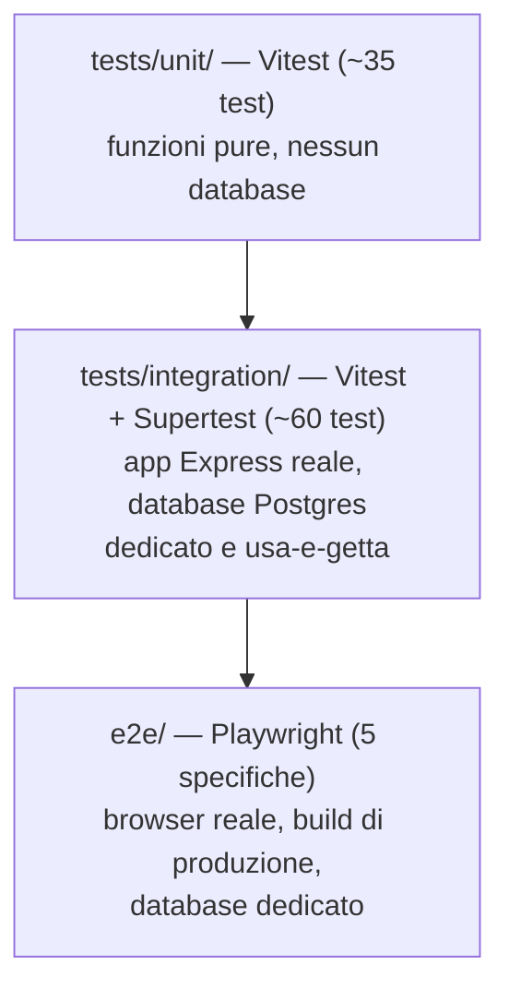

# Documentazione tecnica

## 1. Stack tecnologico

### Frontend
| Tecnologia | Versione | Ruolo |
|---|---|---|
| React | 18.3.1 | Libreria UI |
| Vite | 5.3.4 | Build tool / dev server |
| wouter | 3.3.5 | Routing client-side (~1.5 kB) |
| Tailwind CSS | 3.4.6 | Styling utility-first, dark mode via classe |
| Recharts | 2.x | Grafici (donut chart nella Dashboard) |
| TypeScript | 5.5.3 | Tipizzazione statica, condivisa con il backend via `shared/` |

### Backend
| Tecnologia | Versione | Ruolo |
|---|---|---|
| Express | 4.19.2 | Server HTTP / routing REST |
| Drizzle ORM | 0.31.x | Query builder tipizzato + migrazioni SQL |
| Drizzle Kit | 0.22.8 | Generazione/applicazione migrazioni (`drizzle-kit generate` / `migrate`) |
| pg (node-postgres) | 8.12.0 | Driver PostgreSQL |
| jsonwebtoken | 9.0.2 | Firma/verifica sessioni JWT |
| bcryptjs | 2.4.3 | Hashing password |
| zod | 3.23.8 | Validazione input di ogni endpoint |
| papaparse | 5.4.1 | Parsing/generazione CSV (import/export) |
| cookie-parser | 1.4.6 | Parsing del cookie di sessione |
| esbuild | 0.23.0 | Bundling del server per la build di produzione |
| tsx | 4.16.2 | Esecuzione TypeScript diretta in sviluppo (`watch` mode) |

### Database
- **PostgreSQL** (14+ in locale, Flexible Server Burstable `Standard_B1ms` in produzione)

### Test
| Tecnologia | Versione | Ruolo |
|---|---|---|
| Vitest | 4.1.10 | Unit e integration test |
| Supertest | 7.2.2 | Richieste HTTP contro l'app Express nei test di integrazione |
| Playwright (`@playwright/test`) | 1.62.x | Test end-to-end su browser reale (Chromium) |

### CI/CD e hosting
- **GitHub Actions** — pipeline `test` → `build-and-deploy`
- **Azure App Service** (Linux, piano `B1`) — hosting dell'applicazione
- **Azure Database for PostgreSQL Flexible Server** — database di produzione

## 2. Struttura del repository

```
server/
  app.ts              → app Express configurata (middleware + router), SENZA .listen()
  index.ts             → entry point: dotenv, app.listen()
  db.ts                → connessione PostgreSQL (Pool + istanza Drizzle)
  schema.ts             → schema Drizzle: tabelle, enum, tipi inferiti
  auth.ts               → hashing password, firma/verifica JWT, middleware (requireAuth, requireTab, requireTabWrite)
  activityLog.ts        → helper per scrivere nel registro attività
  commessaId.ts         → generazione slug identificativo commessa
  asyncHandler.ts        → wrapper per propagare errori async agli handler Express
  seed.ts                → crea l'utente admin iniziale (una tantum)
  seedDemoData.ts        → popola dati di esempio (idempotente, additivo)
  routes/                → un file per risorsa: auth, people, projects, assignments,
                            staffing, absences, holidays, settings, users, activity

client/src/
  pages/                 → una pagina per vista di navigazione (Dashboard, People,
                            PersonDetail, Projects, ProjectDetail, PMOverview,
                            Staffing, Calendar, Absences, Settings, Login)
  components/             → componenti riusabili: Layout (sidebar + routing guard),
                            Card, Button, Modal, DonutChart, *Modal (form di
                            creazione/modifica per persona/progetto/assegnazione/assenza)
  lib/                    → api.ts (fetch wrapper + ApiError), auth.tsx (contesto
                            React di autenticazione + permessi), theme.tsx, sort.ts

shared/
  types.ts               → tipi TypeScript e costanti condivisi tra client e server
                            (incl. APP_TABS/SETTINGS_SUB_TABS, fonte unica dei permessi)

drizzle/                → migrazioni SQL generate + snapshot dello schema

tests/
  unit/                   → test puri, nessun database
  integration/             → test contro un database Postgres dedicato e usa-e-getta
  setupEnv.ts, globalSetup.ts → bootstrap ambiente di test (vedi §4)

e2e/                     → specifiche Playwright + globalSetup dedicato

.github/workflows/deploy.yml → pipeline CI/CD
setup-deploy.ps1              → script di provisioning iniziale delle risorse Azure
```

## 3. Modello di percorso dati (request lifecycle)

1. Il componente React chiama `client/src/lib/api.ts` (`api.get/post/put/delete`),
   un thin wrapper su `fetch` con `credentials: "include"` (invia il cookie
   di sessione) che lancia `ApiError` sugli status non-2xx.
2. La richiesta arriva a `server/app.ts`, attraversa la catena middleware
   (vedi [02-architettura.md §3](02-architettura.md#3-catena-middleware-express)).
3. Il router della risorsa valida il body/query con uno schema `zod`
   dedicato (definito nello stesso file del router, non condiviso — ogni
   endpoint valida esattamente ciò che si aspetta).
4. Le query passano da Drizzle (`db.select/insert/update/delete`), mai SQL
   grezzo nei router applicativi.
5. Le mutazioni rilevanti (create/update/delete su persone, progetti,
   assegnazioni, assenze, utenti) scrivono una riga in `activity_log` tramite
   `logActivity()` — un fallimento di questa scrittura viene loggato ma
   **non fa fallire la richiesta originale**.
6. Nella creazione/modifica assegnazioni, `AssignmentModal` applica due
  guard-rail lato UX prima della chiamata API: conferma in caso di
  sovra-allocazione >100% nel periodo e conferma se il progetto è in stato
  diverso da `active`.

## 4. Riferimento API

Tutti gli endpoint sono sotto `/api`. Autenticazione via cookie httpOnly
(nessun header `Authorization`). La colonna "Permesso" indica la sezione
richiesta (`—` = nessuna oltre all'autenticazione); "solo scrittura"
significa che le richieste GET restano aperte a chiunque sia autenticato
(dati condivisi tra sezioni), mentre le mutazioni richiedono il permesso
indicato — vedi [04-sicurezza.md](04-sicurezza.md) per il dettaglio completo.

| Risorsa | Endpoint principali | Permesso (scrittura) |
|---|---|---|
| Auth | `POST /auth/login`, `POST /auth/logout`, `GET /auth/me` | pubblico |
| Persone | `GET/POST /people`, `GET/PUT/DELETE /people/:id`, `GET/POST/DELETE /people/:id/capacity(/:capacityId)`, `GET /people/:id/assignments`, `GET /people/export`, `POST /people/import` | `people` |
| Progetti | `GET/POST /projects`, `GET/PUT/DELETE /projects/:id`, `GET /projects/export`, `POST /projects/import` | `projects` |
| Assegnazioni | `GET/POST /assignments`, `PUT/DELETE /assignments/:id`, `POST /assignments/overwrite`, `POST /assignments/:id/split`, `GET /assignments/export`, `POST /assignments/import` | `staffing` |
| Staffing (sola lettura) | `GET /staffing/snapshot?from&to` | — (nessun permesso dedicato, solo autenticazione) |
| Assenze | `GET/POST /absences`, `PUT/DELETE /absences/:id`, `PUT /absences/:id/status`, `GET /absences/export`, `POST /absences/import` | `absences` |
| Festività | `GET/POST /holidays`, `DELETE /holidays/:id` | `settings` + `settings:holidays` |
| Impostazioni soglie | `GET/PUT /settings` | `settings` + `settings:thresholds` |
| Utenti | `GET/POST /users`, `PUT/DELETE /users/:id` | `settings` + `settings:users` (**incluse le GET**) |
| Registro attività | `GET /activity` | `settings` + `settings:activity` (**incluse le GET**) |

Note endpoint:
- `POST /people/import` restituisce anche `errors: { row, reason }[]` in caso
  di righe scartate, così il frontend può mostrare il motivo puntuale nel
  popup di import.

## 5. Testing

Strategia a tre livelli (piramide dei test):



- **Unit** (`tests/unit/`): middleware di permessi, hashing/JWT, risoluzione
  capacità variabile, parsing CSV/date di ogni router. Nessun database.
- **Integration** (`tests/integration/`): un file per router (incluso
  l'algoritmo di sovrascrittura/divisione dello staffing e l'intera matrice
  di gating dei permessi), eseguiti contro un database Postgres **dedicato e
  usa-e-getta** (`TEST_DATABASE_URL`), svuotato con `TRUNCATE` prima di ogni
  test. Si saltano automaticamente se `TEST_DATABASE_URL` non è configurata,
  per garantire che non possano mai toccare un database reale.
- **End-to-end** (`e2e/`): Playwright pilota un vero browser Chromium contro
  una build di produzione servita su una porta isolata (3100), anch'essa
  puntata sul database di test; copre login, CRUD via UI e l'intero flusso
  di gating dei permessi (navigazione nascosta, pagina di accesso negato).

Comandi:
```bash
npm test          # unit + integration (Vitest)
npm run test:e2e  # end-to-end (Playwright)
npm run check     # type-check (tsc --noEmit)
```

Setup di un database di test locale: vedi [README §5](../README.md).

## 6. CI/CD

`.github/workflows/deploy.yml`, due job in sequenza:

1. **`test`** (gira su ogni push su `main`): container di servizio
   PostgreSQL effimero, `npm ci`, `npx playwright install --with-deps
   chromium`, `npm run check`, `npm test`, `npm run test:e2e`. In caso di
   fallimento dei test e2e, il report HTML di Playwright viene caricato come
   artefatto.
2. **`build-and-deploy`** (`needs: test`, gira solo se il job precedente
   passa): `npm run build`, deploy su Azure App Service tramite
   `azure/webapps-deploy@v3` (publish profile in un secret del repository).

Le migrazioni del database di **produzione** non fanno parte della pipeline
automatica: si applicano manualmente con `npm run db:migrate` puntando a
`DATABASE_URL` di produzione (scelta deliberata, per non eseguire mai una
migrazione distruttiva senza supervisione umana).

## 7. Convenzioni di sviluppo

- **Migrazioni**: `server/schema.ts` è la fonte di verità → `npm run
  db:generate` genera l'SQL in `drizzle/` → si rivede il file generato →
  `npm run db:migrate` lo applica. Mai modificare lo schema del database a
  mano.
- **Seeding idempotente**: `seedDemoData.ts` e `seed.ts` verificano sempre
  l'esistenza di una riga (per email/nome) prima di inserirla — possono
  essere rieseguiti senza duplicare né sovrascrivere dati.
- **Tipi condivisi**: qualunque tipo/costante usato sia dal client sia dal
  server (es. `APP_TABS`, `AuthUser`) vive in `shared/types.ts`, importato
  con l'alias `@shared/*` da entrambi i lati.
- **Palette colori categoriale**: la stessa palette validata (contrasto,
  distinguibilità per daltonismo) è condivisa tra i grafici della Dashboard
  e i selettori colore di `PersonModal`/`ProjectModal`.
